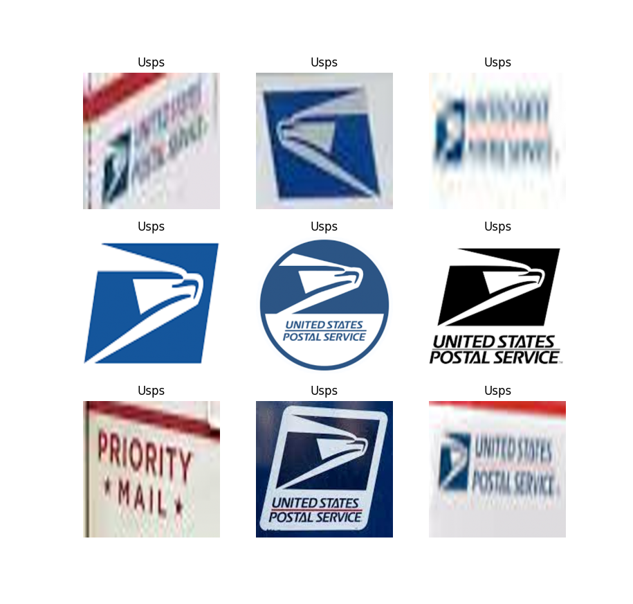
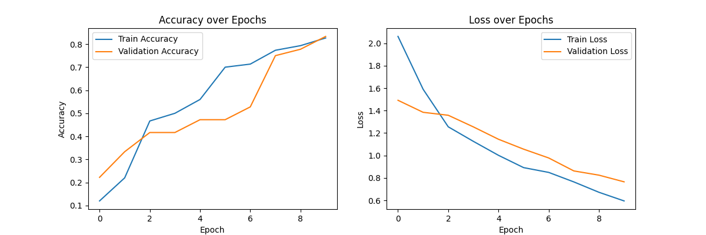
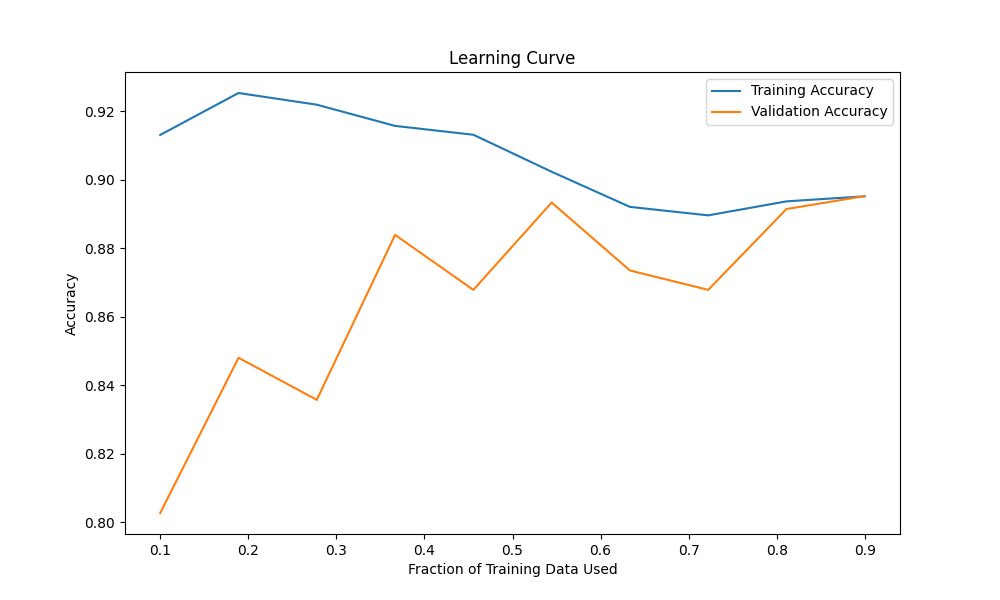
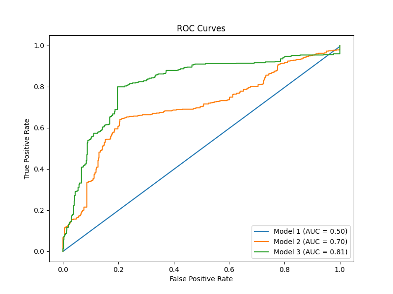
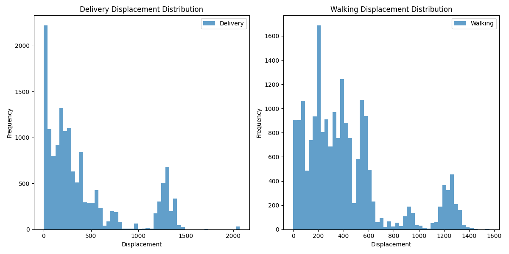
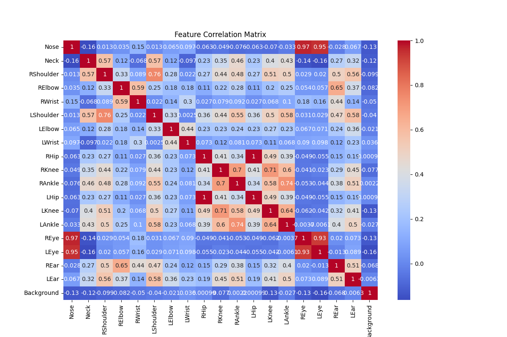

# Delivery Motion Classification

## Problem Description
Surveillance cameras like RingCentral can detect motion but can't specify what's moving, which is a problem in places like Dorchester and Roxbury in Boston where package theft is common. The challenge is to distinguish between delivery-related movement and other activities and to identify the delivery company involved. This lack of detailed motion classification leads to a higher risk of theft, as alerts don't provide enough information to prevent or investigate incidents effectively. To address this, an integrated model that can accurately classify and categorize motion is crucial for enhancing security and reducing parcel theft.

## Project Overview
This project focuses on improving security systems by creating a model that can tell apart actions related to delivering and non-delivery humans. Making this distinction is key to tackling the issue of stolen packages.
* Delivery Classification: The heart of the system is a trained model that distinguishes between delivery and non-delivery motion. This ability is critical for spotting possible theft.
* Logo Detection: The model's ability to correctly identify enhanced images by using InceptionV3, a cutting-edge technology that detects logos. It helps the system recognize and sort well-known delivery companies like Amazon, USPS, and Walmart, sharpening its ability to classify deliveries.

## Getting Started

These instructions will get you a copy of the project up and running on your local machine for development and testing purposes.

### Prerequisites
- Python 3.x
- pip

### Installing
- First, clone the repository or download the zip file and extract it.
`git clone https://yourrepository.git`
- Navigate to the project directory:\
`cd <your-project-directory>`
- Install the required dependencies:\
`pip install -r requirements.txt`

### Running the Models

#### Logo Detection Model
The logo detection model employs the InceptionV3 architecture, leveraging transfer learning to accurately identify and classify company logos. This model has been trained on a diverse dataset and is robust to variations in the logo appearance, including distortions and different scales.

- To train the logo detection model: (the model is already trained and saved) \
`python logo_detection/logo_detection.py`

- To test the logo detection model: \
- `python logo_detection/test_model.py`

#### Posture Detection Model
The posture analysis model uses pose estimation points to assess and classify human postures. This model is trained to distinguish between delivery and non-delivery postures, which can be applied to ergonomic studies or activity recognition.
- To train the posture detection model: (the model is already trained and saved) \
`python posture_model.py`
- To test the posture detection model: \
`python test_posture_model.py`
#### Displacement Calculation

To calculate displacement using the displacement module:\
python displacement.py

#### Main Integration
The `main.py` script orchestrates the process of classifying a video as either a 'delivery' or 'non-delivery' event and subsequently detecting logos within the video frames. It operates in the following steps:

1. **Load Models**: The script loads two pre-trained models – one for delivery classification (`pose_detection_model`) and another for logo detection (`logo_detection_model`).

2. **Preprocess Video**: The input video is processed to extract frames and detect poses, which are then used to calculate displacements necessary for the delivery classification model.

3. **Classify Video**: The script runs the delivery classification model on the processed data to predict whether the video represents a delivery event.

4. **Detect Logo**: If the video is classified as a delivery, the script proceeds to detect logos within the frames using a sliding window approach and the loaded logo detection model. It supports multi-scale detection by varying window sizes.

5. **Output Results**: The predictions for each frame are plotted, showing the probability of the frame being classified as a delivery event. If a logo is detected with high probability, the script prints the logo label and probability, and displays the frame with the detected logo.

6. **Run on Sample Video**: The script is set up to run the integrated process on a sample video provided at `test_data/test_pose.mp4`.

To run the integration of both models:\
`python main.py`

Note: Please ensure that the required models and data preprocessing scripts are correctly placed in the respective directories as specified in the code.

#### Testing Models

- To test the posture model separately:\
`python test_posture_model.py`

- To test the logo detection model separately:\
`python logo_detection/test_model.py`

## Results
### Model Performance
* The logo detection performance is illustrated in the below graph, which showcases the model's precision in classifying different company logos.
#### Logo Detection Accuracy and Loss while training

* The model's accuracy and loss over epochs are displayed in below graph, revealing how the model's performance has evolved throughout the training process. Additionally, the image depicts of the ROC curve, with the Area Under the Curve (AUC) metric indicating the model's classification efficacy.
#### Learning Curve

#### ROC - AUC

#### Training Data Displacement Distribution

#### Feature scaling and Importance

The above images provide insight into the features' relationships and their importance in the model's decision-making process. These visualizations are critical for understanding the underlying factors that the posture model considers when making a prediction.
## Built With

* [TensorFlow](https://www.tensorflow.org/) - The machine learning framework used
* [OpenCV](https://opencv.org/) - Image processing library
* [Pandas](https://pandas.pydata.org/) - Data manipulation and analysis
* [NumPy](https://numpy.org/) - Mathematical functions on large, multi-dimensional arrays and matrices
* [Matplotlib](https://matplotlib.org/) - Plotting library

## Authors

* **Adnan Ali** - Project Lead & Main Contributor

As a Master's degree holder in Computer Science from UMass Boston, I have utilized my expertise in machine learning and computer vision to spearhead the development of this integrated model system. 
With a keen eye for innovative solutions, I have orchestrated the seamless fusion of posture analysis and logo detection models, showcasing state-of-the-art techniques in the realm of AI.

Connect :
- [GitHub](https://github.com/adi-tsvet)
- [LinkedIn](https://www.linkedin.com/in/adi-tsvet/) 
## References

* Durupinar, F. (2021). Perception of Human Motion Similarity Based on Laban Movement Analysis. ACM Symposium on Applied Perception 2021, 1–7. https://doi.org/10.1145/3474451.3476241
* Durupinar, F., Kapadia, M., Deutsch, S., Neff, M., & Badler, N. I. (2017). PERFORM: Perceptual Approach for Adding OCEAN Personality to Human Motion Using Laban Movement Analysis. ACM Transactions on Graphics, 36(1), 1–16. https://doi.org/10.1145/2983620
* Wikipedia The Free Encyclopedia. (2022). An example of computer animation using motion capture. Computer animation. Retrieved December 2, 2022, from https://upload.wikimedia.org/wikipedia/commons/6/6d/Activemarker2.PNG.
* OpenAI. (2023). ChatGPT (Version GPT-3.5) [Software]. https://openai.com/chatgpt

